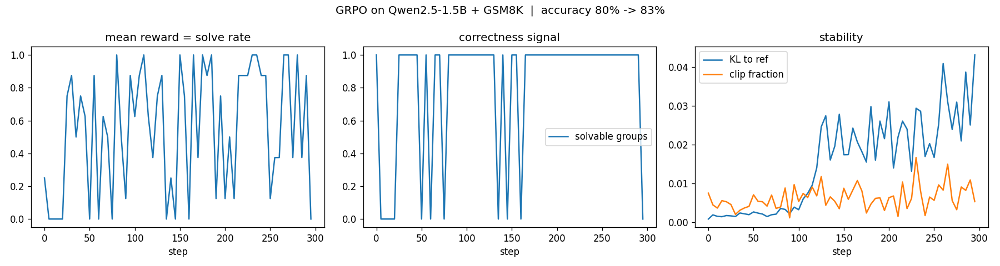

# GRPO from Scratch

A ground-up implementation of **GRPO** (Group Relative Policy Optimization) — the reinforcement-learning algorithm behind today's reasoning models — with **no TRL or other RL libraries**. Every mechanic (grouped sampling, the group-relative advantage, per-token masking, the clipped surrogate objective, the KL penalty) is written out explicitly and verified by execution.

It's equal parts **tutorial series** (build GRPO from first principles) and **working training pipeline**: a hand-written GRPO loop that fine-tunes **Qwen2.5-1.5B-Instruct** on GSM8K and lifts its accuracy **80.0% → 83.0%** on a single A100.



---

## Result


| Model                        | GSM8K accuracy (100 problems, greedy) |
| ---------------------------- | ------------------------------------- |
| Qwen2.5-1.5B-Instruct (base) | 80.0%                                 |
| **+ GRPO (this repo)**       | **83.0%** (+3.0)                      |


Trained with a hand-written GRPO loop — LoRA (`r=16`), a **pure verifiable 0/1 correctness reward**, group size 8 — for 300 steps in ~80 minutes on one A100 40 GB. Full config in `[results/result.json](results/result.json)`, per-step metrics in `[results/history.json](results/history.json)`.

**Honest framing.** The base model is already strong at GSM8K, so this is a *modest, real* gain — which is exactly what outcome-reward GRPO does to an already-capable model. The value of this repo is a correct, transparent, fully-debugged implementation, and a genuine (not cherry-picked) result reported with its caveats. See [Results in detail](#results-in-detail) and [Limitations](#limitations--future-improvements).

---

## What's inside

- **Conceptual tutorials** that build GRPO from first principles, assuming no prior RL.
- **From-scratch implementations** on a toy model *and* a real LLM, each verified by running.
- **The real training pipeline** — `[code/grpo_gsm8k.py](code/grpo_gsm8k.py)`, the run behind the result above.
- **Debugging & tuning guides** grounded in the actual failure modes hit while building this (see [Pitfalls & lessons](#pitfalls--lessons-the-debugging-journey)).
- **A self-check exam** and an **FAQ** of the non-obvious gotchas.

## Repo structure

```
grpo-from-scratch/
├── README.md
├── requirements.txt
├── LICENSE
├── .gitignore
├── FAQ.md                          # the non-obvious gotchas
├── tutorials/
│   ├── 01-grpo-intro.md            # GRPO + the group baseline (self-contained background)
│   ├── 02-grpo-from-scratch.md     # the full GRPO loop on a toy model
│   └── 03-grpo-real-llm.md         # GRPO on Qwen2.5 + GSM8K (the masking chapter)
├── guides/
│   ├── debugging-grpo.md           # failure modes + metric dashboard
│   └── grpo-tuning-guide.md        # reusable "read the gauge, turn the knob" reference
├── exercises/
│   └── grpo-self-check.md          # self-assessment + answer key
├── code/
│   ├── grpo_gsm8k.py               # the real A100 training run
│   ├── grpo_toy.py                 # toy GRPO (runs in seconds)
│   └── grpo_tuning.py              # instrumented hyperparameter sweeps
├── notebooks/
│   └── grpo_qwen15b_gsm8k.ipynb    # the same run as a notebook
├── assets/
│   ├── grpo-mask-diagram.svg
│   └── curves.png
└── results/
    ├── history.json
    └── result.json
```

## Quickstart

```bash
pip install -r requirements.txt

# 1. confirm the run will actually learn (samples a few groups, reports the signal)
python code/grpo_gsm8k.py --diagnostic-only

# 2. full training run (writes results/ and assets/curves.png)
#    expandable_segments avoids fragmentation OOMs on a 40 GB card
PYTORCH_CUDA_ALLOC_CONF=expandable_segments:True python code/grpo_gsm8k.py

# knobs
python code/grpo_gsm8k.py --steps 150 --group 16 --prompts-per-step 1
```

Every hyperparameter is an argparse flag; `python code/grpo_gsm8k.py --help` lists them.

## Tutorials — start here

Read in order for a full path from "no RL" to "trained a real model":

1. **[GRPO and the group baseline](tutorials/01-grpo-intro.md)** — the one idea (replace the critic with a group-relative baseline), with just-enough self-contained background on advantages, the importance ratio, clipping, and the KL penalty.
2. **[GRPO from scratch](tutorials/02-grpo-from-scratch.md)** — the full loop on a tiny model with a verifiable reward, runnable in seconds.
3. **[GRPO on a real LLM](tutorials/03-grpo-real-llm.md)** — Qwen2.5 + GSM8K: the tokenizer, chat template, and the three masks that actually break real runs.

Then: [debugging guide](guides/debugging-grpo.md) · [tuning guide](guides/grpo-tuning-guide.md) · [self-check exam](exercises/grpo-self-check.md) · [FAQ](FAQ.md).

## How it works (the loop in one paragraph)

For each prompt, sample a **group** of `G` completions. Score each with a **verifiable reward** (is the final answer correct?). The **advantage** of each completion is its reward minus the group mean, divided by the group std — no critic, no value network; the group *is* the baseline. Update the policy with PPO's **clipped surrogate** on those advantages, plus a **KL penalty** toward a frozen reference to prevent drift. That's it — the critic and GAE that PPO needs are gone, replaced by "compare each answer to its peers." The [intro tutorial](tutorials/01-grpo-intro.md) derives every piece.

## Implementation notes — the non-obvious parts

The tricks that separate "understands GRPO" from "can run GRPO," each learned the hard way here:

- **The `ratio == 1` invariant.** On the first update epoch of a fresh batch the policy hasn't moved, so every completion-token importance ratio must be *exactly* 1. Asserting this catches masking/bookkeeping bugs the instant they appear, before wasting GPU hours. It's the cheapest, highest-value check in the loop.
- **Three masks, three jobs.** `completion_mask` (real generated tokens, stopping at the first EOS), `full_attn` (what the model may *read* — prompt **and** completion), and `loss_mask` (what to *train on* — completion only), with a one-token shift to align with next-token log-probs. Visualized in `[assets/grpo-mask-diagram.svg](assets/grpo-mask-diagram.svg)`.
- **The reference model is free.** Reference log-probs (for the KL penalty) come from the base weights via `policy.disable_adapter()` — no second copy of the model in memory.
- **Memory-efficient log-probs.** `logit[target] − logsumexp(logits)` gives the same result as a full `log_softmax` without materializing a vocabulary-sized fp32 tensor — the allocation that OOMs a naive implementation on a real model.
- **Verifiable reward + robust parsing.** A 0/1 reward is only as good as the answer extractor: it must read `####`, `\boxed{}`, and "final answer" formats and compare **numerically** (so `24.0` matches `24`). A lossy parser silently starves training *and* mis-reports accuracy.
- **Diagnose the signal before you spend money.** `--diagnostic-only` samples a few groups and reports the fraction that are *mixed* (some right, some wrong) vs *all-correct* / *all-wrong*. Only mixed groups produce a gradient, so this tells you whether a run can learn *before* you launch it. This run's check: **72% mixed, 78% solvable, 28% zero-advantage** — a healthy regime.
- **Pure 0/1 reward, deliberately.** Reward shaping is where reward hacking is born (a length term teaches the model to be short, not correct). With a capable base model whose groups have a right/wrong mix, unshaped verifiable reward is both cleaner and unhackable.

## Pitfalls & lessons (the debugging journey)

Most of these produced *no error* — they silently made the model learn the wrong thing or nothing at all. Each is documented in the [debugging guide](guides/debugging-grpo.md). This table is the real story of the project:


| Symptom                                                  | Root cause                                                                                                                    | Fix                                                                                              |
| -------------------------------------------------------- | ----------------------------------------------------------------------------------------------------------------------------- | ------------------------------------------------------------------------------------------------ |
| Reward stuck at 0, every group all-wrong                 | 0.5B model too weak → no correct sample in any group of 8 → zero advantage everywhere                                         | move to a competent base (1.5B); use `--diagnostic-only` to verify solvable groups first         |
| Baseline looked like **18%** (really ~80%)               | extractor was blind to the model's `\boxed{}` answers → correct answers scored wrong                                          | robust extractor (`####`, `\boxed{}`, "final answer", last-number fallback) + numeric comparison |
| Reward "improved" but the model just got **shorter**     | a `-len` brevity term in the reward → length hacking, and it manufactured fake reward variance that hid the no-signal problem | delete shaping; use pure 0/1 verifiable reward                                                   |
| Extractor pulling intermediate numbers                   | completions truncated before the answer line (`MAX_NEW=200`)                                                                  | raise `MAX_NEW` to 400 so the model reaches `####`                                               |
| OOM inside `per_token_logps`                             | full-vocabulary fp32 `log_softmax` allocates ~3 GB transient tensors per pass                                                 | `logit[target] − logsumexp(logits)` — no fp32 vocab copy                                         |
| OOM in the **training step** (eval/generation were fine) | training builds an autograd graph over a 32-sequence batch; vocab-sized logits × backward blew past 40 GB                     | lower `--prompts-per-step` (batch, not length) + `expandable_segments:True`                      |
| Two GPUs slower and crash-prone                          | `device_map="auto"` shards a tiny model → cross-GPU comms + device-mismatch fragility                                         | single GPU (`.to("cuda:0")`); the model is 3 GB, it doesn't need sharding                        |
| Fear of silent masking bugs                              | off-by-one in any of the three masks would corrupt training invisibly                                                         | `assert ratio == 1` on epoch 0 — fires instantly if a mask is misaligned                         |


The meta-lesson: in RL post-training the algorithm is the easy 20%. The reward, the data plumbing (tokenizer, chat template, masking, padding), and the memory budget are where real runs live or die — and almost none of it throws an exception when it's wrong.

## Results in detail

- **Task:** GSM8K (grade-school math), verifiable numeric answers.
- **Method:** hand-written GRPO — grouped sampling, group-relative advantage, clipped surrogate + k3 KL — with LoRA (`r=16`) on Qwen2.5-1.5B-Instruct.
- **Accuracy:** **80.0% → 83.0%** (+3.0 points) on a fixed 100-problem set, greedy decoding, same problems before and after.
- **Signal:** `solvable-groups` sits at ~1.0 for almost the whole run after step 20 — the model consistently had a teachable mix of right/wrong completions.
- **Reward shape:** a fast rise off the floor in the first ~25 steps (early tightening), then a healthy oscillating plateau in the 0.4–0.9 band — the expected shape when starting from an already-strong base.
- **Stability:** KL to the reference climbed gradually from ~~0.001 to ~0.043 and clip fraction stayed low (~~0.005–0.015). The run never destabilized.

**Two honest caveats** (stated because a careful reader would spot them):

1. **KL was still rising at step 295.** The policy hadn't fully equilibrated and mild drift was setting in by the end. It doesn't invalidate the 83% (that's a held-out greedy eval), but a slightly higher `--beta` or early-stopping around step ~130 (where KL begins climbing) would likely give a cleaner run.
2. **±~5–6 point confidence interval at n=100.** A 100-problem eval makes +3 points a *real but not razor-sharp* result. The rigorous version evaluates on the full 1,319-problem GSM8K test set for a tighter number (see below).

## Limitations & future improvements

- **Tighter evaluation.** Re-run the before/after on the full GSM8K test set (1,319 problems) to shrink the confidence interval on the +3 points.
- **Cleaner run.** Raise `--beta` slightly or early-stop where KL starts climbing (~step 130) to counter the end-of-run drift.
- **Less noisy signal.** `--prompts-per-step 1` was forced by memory; micro-batching `per_token_logps` (gradient accumulation over sub-batches) would allow `prompts_per_step > 1` on 40 GB, giving a smoother reward curve.
- **More headroom.** A larger model, or a harder dataset like MATH (where a 1.5B model sits well below its ceiling), would show a larger climb than an already-80% base allows.
- **Algorithm refinements — all small edits to this loop:** DAPO-style *dynamic sampling* (skip zero-advantage groups), *Dr. GRPO* (drop the length/std normalization biases), and *Clip-Higher* (asymmetric clip range to preserve exploration). Covered in the [tuning guide](guides/grpo-tuning-guide.md).
- **Faster rollouts.** Generation dominates step time; a vLLM-accelerated rollout is the obvious scaling win.

## License

MIT — see [LICENSE](LICENSE).

## Acknowledgements

Built as a from-scratch study of RL post-training. GRPO is from the DeepSeekMath / DeepSeek-R1 line of work; the refinements referenced above are from Dr. GRPO and DAPO. GSM8K is from OpenAI. The model is Qwen2.5-1.5B-Instruct.
