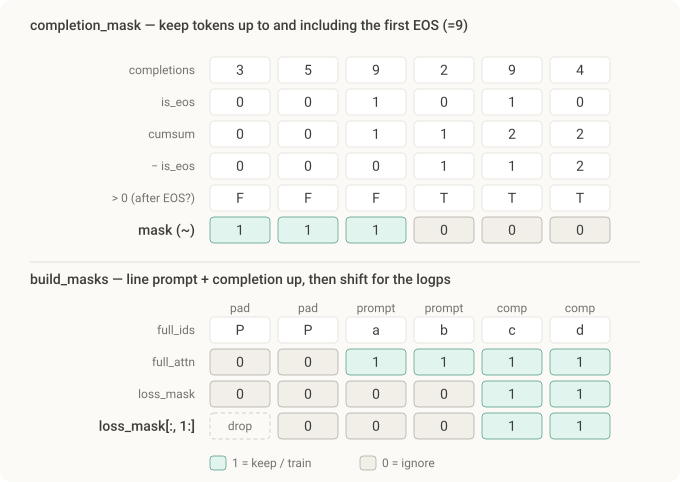

# GRPO from Scratch on a Real LLM — Qwen2.5 + GSM8K

*~15 minute read*

**On this page**

- [Background & Motivation](#background--motivation)
- [What Actually Changes When You Go Real](#what-actually-changes-when-you-go-real)
- [Setup: Model, Reference, and LoRA](#setup-model-reference-and-lora)
- [The Dataset: GSM8K + the Chat Template](#the-dataset-gsm8k--the-chat-template)
- [The Verifiable Reward (and a Parsing Bug Everyone Hits)](#the-verifiable-reward-and-a-parsing-bug-everyone-hits)
- [Step 1: Grouped Generation](#step-1-grouped-generation)
- [Step 2: Per-Token Log-Probs and the Masking Trap](#step-2-per-token-log-probs-and-the-masking-trap)
- [Step 3: Group-Relative Advantage](#step-3-group-relative-advantage)
- [Step 4: The Clipped Loss + KL (Our Own Algorithm)](#step-4-the-clipped-loss--kl-our-own-algorithm)
- [The Full Training Loop](#the-full-training-loop)
- [Debugging It Properly](#debugging-it-properly)
- [From Here](#from-here)
- [Conclusion](#conclusion)

## Background & Motivation

In the first GRPO-from-scratch tutorial you built the whole algorithm on a tiny toy model and watched the reward climb. This one keeps **exactly that hand-written loop** — no TRL, no `GRPOTrainer`, your own GRPO — and points it at a **real model** (Qwen2.5-0.5B-Instruct) solving **real problems** (GSM8K grade-school math).

The algorithm doesn't change. What changes is everything *around* it — and that "everything around it" is where real GRPO runs actually break:

- a real **tokenizer** and **chat template** instead of integer toys,
- **variable-length prompts**, which forces careful **padding and masking**,
- a **verifiable reward** that parses the model's answer (and fails in annoying ways),
- and the **debugging** you need when, unlike the toy, it doesn't just work the first time.

> **On verification.** The toy tutorial was run end to end. Here, a full training run needs a GPU and model weights, so I can't reproduce the whole thing inline. But the parts that actually break — the per-token log-prob alignment, the prompt/padding masking, the `ratio == 1` sanity check, the clipped loss + KL, the generation/grouping plumbing, and the answer parser — were all verified against the **real Qwen2 architecture** (built from its config) and are correct as written. The model-download and dataset-loading lines follow Qwen and GSM8K's official usage. I'll flag anything you should expect to tune for your hardware.

## What Actually Changes When You Go Real

| | Toy tutorial | This tutorial |
| --- | --- | --- |
| Model | `TinyGPT` (random init) | Qwen2.5-0.5B-Instruct (pretrained) |
| Prompt | one fixed token | GSM8K questions via chat template |
| Lengths | all identical | variable → **padding + masking** required |
| Reward | count vowels | parse answer, check vs. gold (verifiable) |
| Reference | frozen copy | base model via **disabled LoRA adapter** |
| Efficiency | trivial | **LoRA** + small batches to fit a modest GPU |

The GRPO core — sample a group, advantage = relative-to-group, clipped update with a KL leash — is identical. Let's build the wrapping.

## Setup: Model, Reference, and LoRA

We load the model once and attach a **LoRA** adapter so we only train a few million parameters (full fine-tuning a 0.5B model with grouped rollouts is heavy). A neat trick handles the reference model: instead of keeping a second full copy in memory for the KL penalty, we get reference log-probs by **temporarily disabling the LoRA adapter** — the frozen base weights *are* the reference.

```python
import torch, torch.nn.functional as F, re
from transformers import AutoModelForCausalLM, AutoTokenizer
from peft import LoraConfig, get_peft_model

device = "cuda"
MODEL = "Qwen/Qwen2.5-0.5B-Instruct"

tok = AutoTokenizer.from_pretrained(MODEL)
tok.padding_side = "left"                       # left-pad so batched generation aligns
if tok.pad_token is None:
    tok.pad_token = tok.eos_token

policy = AutoModelForCausalLM.from_pretrained(MODEL, torch_dtype=torch.bfloat16).to(device)
policy = get_peft_model(policy, LoraConfig(
    r=16, lora_alpha=32, lora_dropout=0.0,
    target_modules=["q_proj", "k_proj", "v_proj", "o_proj"],
))
policy.print_trainable_parameters()             # ~1% of params
opt = torch.optim.AdamW([p for p in policy.parameters() if p.requires_grad], lr=1e-5)
```

The reference, on demand:

```python
def ref_logps(input_ids, attention_mask):
    """Reference = base model with the LoRA adapter switched off."""
    with torch.no_grad(), policy.disable_adapter():
        return per_token_logps(policy, input_ids, attention_mask)
```

## The Dataset: GSM8K + the Chat Template

GSM8K is 7.5k grade-school word problems. Each example has a `question` and an `answer` whose final line is `#### <number>`. We want the model to reason and then emit its answer in a parseable form, so we wrap each question in Qwen's chat template with a system instruction.

```python
from datasets import load_dataset

SYSTEM = ("You are a helpful math assistant. Reason step by step, "
          "then give the final answer on a new line as: #### <number>")

def build_prompt(question):
    messages = [{"role": "system", "content": SYSTEM},
                {"role": "user", "content": question}]
    # add_generation_prompt=True appends the '<|im_start|>assistant' turn opener
    return tok.apply_chat_template(messages, tokenize=False, add_generation_prompt=True)

data = load_dataset("openai/gsm8k", "main", split="train")
prompts = [build_prompt(ex["question"]) for ex in data]
golds   = [ex["answer"].split("####")[-1].strip() for ex in data]   # the gold number
```

The chat template turns each question into the Qwen format the instruct model expects:

```
<|im_start|>system
You are a helpful math assistant. Reason step by step, then give ... #### <number><|im_end|>
<|im_start|>user
Natalia sold clips to 48 friends ...<|im_end|>
<|im_start|>assistant
```

That trailing `<|im_start|>assistant` is where generation begins.

## The Verifiable Reward (and a Parsing Bug Everyone Hits)

No reward model needed: we **check the answer**. Extract the final number from the model's output, compare it to the gold number, give 1.0 for a match and 0.0 otherwise. Simple — except answer parsing is deceptively fragile.

The naive "grab the last number" extractor pulls `"18."` (with a trailing period) from a sentence ending in `...is 18.`, and then `"18." != "18"` fails a string match. The same bug marks `"24.0"` wrong against gold `"24"`. The fix is to clean the number and **compare numerically**, not as strings:

```python
def extract_answer(text):
    m = re.search(r"####\s*(-?[\d,]+(?:\.\d+)?)", text)   # preferred: the #### form
    if m:
        return m.group(1).replace(",", "")
    nums = re.findall(r"-?\d[\d,]*\.?\d*", text)           # fallback: last number
    return nums[-1].replace(",", "").rstrip(".") if nums else None

def numbers_equal(a, b):
    if a is None or b is None:
        return False
    try:
        return abs(float(a) - float(b)) < 1e-6            # 24 == 24.0
    except ValueError:
        return str(a) == str(b)

def reward_fn(completion_text, gold):
    return 1.0 if numbers_equal(extract_answer(completion_text), gold) else 0.0
```

This is the single most underestimated part of a real GRPO run: **a buggy reward silently teaches the model the wrong thing.** When a reward looks stuck at zero, suspect the parser before the algorithm — print a few `(completion, extracted, gold)` triples and read them.

## Step 1: Grouped Generation

The "group" in GRPO comes from sampling several completions per prompt. With a real model we generate them in a batch using `num_return_sequences=G`, with **sampling on** (temperature) so the group is diverse — diversity is what gives the group a spread of rewards to compare.

```python
GROUP = 8          # completions per prompt
MAX_NEW = 256      # max completion length

@torch.no_grad()
def generate_group(prompt_batch):
    enc = tok(prompt_batch, return_tensors="pt", padding=True).to(device)
    out = policy.generate(
        **enc, max_new_tokens=MAX_NEW, do_sample=True, temperature=1.0, top_p=1.0,
        num_return_sequences=GROUP, pad_token_id=tok.pad_token_id,
    )                                          # (len(prompt_batch)*GROUP, prompt_len + gen)
    prompt_len = enc.input_ids.shape[1]        # left-padded, so this is constant
    completions = out[:, prompt_len:]
    # group i (for prompt i) is rows [i*GROUP : (i+1)*GROUP]
    return out, enc.attention_mask, prompt_len, completions
```

## Step 2: Per-Token Log-Probs and the Masking Trap

This is where the toy hand-waved and the real version earns its keep. We need $\log \pi(\text{token})$ for each **completion** token — never the prompt, never the padding. Three masks have to line up perfectly.

First, per-token log-probs, aligned so that the logits at position $t$ score the token at $t{+}1$:

```python
def per_token_logps(model, input_ids, attention_mask):
    """logp of each actual next token -> (B, T-1), aligned to input_ids[:, 1:]."""
    logits = model(input_ids=input_ids, attention_mask=attention_mask).logits[:, :-1, :]
    logp = F.log_softmax(logits.float(), dim=-1)
    return logp.gather(-1, input_ids[:, 1:].unsqueeze(-1)).squeeze(-1)
```

Then the **completion mask**: 1 for generated tokens up to and including the first end-of-turn token, 0 for everything else (prompt tokens, post-EOS padding). This is what restricts the loss to the tokens the model actually chose.

```python
def completion_mask(completions, eos_id):
    is_eos = (completions == eos_id)
    after_eos = (is_eos.cumsum(1) - is_eos.long()) > 0    # True strictly after first EOS
    return (~after_eos).long()                            # 1 = real completion token

# assemble the full-sequence attention mask = [prompt mask | completion validity]
def build_masks(full_ids, prompt_attn, prompt_len, eos_id):
    comp = full_ids[:, prompt_len:]
    cmask = completion_mask(comp, eos_id)                                  # (B, gen)
    full_attn = torch.cat([prompt_attn.repeat_interleave(GROUP, 0), cmask], dim=1)
    loss_mask = torch.cat([torch.zeros_like(prompt_attn).repeat_interleave(GROUP, 0),
                           cmask], dim=1)[:, 1:].float()                   # align to (B, T-1)
    return full_attn, loss_mask
```

Those two functions are dense, so let's run a tiny example through them by hand — reading the tensors top to bottom is the whole explanation.



The same walk-through in tensors (read top to bottom):

**`completion_mask` — how the cumsum trick stops at the first EOS.** The goal is to keep generated tokens up to *and including* the first EOS (the legitimate end of the answer) and drop everything after (which is just padding). Trace a completion `[3, 5, 9, 2, 9, 4]` with `EOS = 9`:

| row | | | | | | |
|---|---|---|---|---|---|---|
| `completions` | 3 | 5 | **9** | 2 | 9 | 4 |
| `is_eos` | 0 | 0 | 1 | 0 | 1 | 0 |
| `cumsum` | 0 | 0 | 1 | 1 | 2 | 2 |
| `− is_eos` | 0 | 0 | 0 | 1 | 1 | 2 |
| `> 0` (after EOS?) | F | F | F | T | T | T |
| **`mask` (~)** | **1** | **1** | **1** | 0 | 0 | 0 |

- `is_eos` flags both 9s: `[0,0,1,0,1,0]`.
- `cumsum` (running total left→right) gives `[0,0,1,1,2,2]` — it's `0` before any EOS and jumps to `≥1` from the first EOS onward. Close, but it flags the first EOS itself, which we want to *keep*.
- `− is_eos` is the trick: subtracting the flag pulls the first-EOS column back down to `0` (watch the `1` at the EOS position cancel), giving `[0,0,0,1,1,2]` — now nonzero *strictly after* the first EOS.
- `> 0` asks "is this strictly after the first EOS?" → `[F,F,F,T,T,T]`, and `~` flips it to "keep?" → the final mask `[1,1,1,0,0,0]`.

So the subtraction is a one-line way to say *"include the first EOS, exclude the rest."* (If a row has no EOS at all, `cumsum` stays all zeros and the whole completion is kept — exactly right.)

**`build_masks` — two masks, and why one gets shifted.** The forward pass sees the full sequence `[P, P, a, b, c, d]` (left-pad, prompt, completion), so the masks must span the whole thing:

| row | `P` (pad) | `P` (pad) | `a` (prompt) | `b` (prompt) | `c` (comp) | `d` (comp) |
|---|---|---|---|---|---|---|
| `full_attn` | 0 | 0 | 1 | 1 | 1 | 1 |
| `loss_mask` | 0 | 0 | 0 | 0 | 1 | 1 |
| `loss_mask[:, 1:]` | *(dropped)* | 0 | 0 | 0 | 1 | 1 |

- `full_attn` = `[prompt_attn | completion_mask]`. It's `1` wherever a token is *real* — including the prompt, because the model genuinely needs to *read* the prompt to predict the completion. Only the left-pads are `0`.
- `loss_mask` zeros out the *entire* prompt block and keeps only the completion — because you train on the tokens the model *chose*, never on the prompt it was given.
- `loss_mask[:, 1:]` drops the first column. This is the alignment step everyone trips on: per-token log-probs come from "logits at position `t` predict token `t+1`", so there are only `T−1` of them, aligned to positions `1…T−1`. Dropping column 0 lines the mask up exactly with those log-probs, so `(per_tok_loss * loss_mask).sum() / loss_mask.sum()` averages over *precisely the generated tokens and nothing else*.

**Three masks, three jobs:** `completion_mask` finds the real generated tokens (stopping at the first EOS), `full_attn` lets the model *read* prompt + completion while ignoring padding, and `loss_mask` (shifted by one) restricts *training* to only the completion tokens. That one-token shift is exactly what the next check protects.

**The `ratio == 1` sanity check.** On the first update epoch over a fresh batch, the policy hasn't changed yet, so every completion-token ratio must be exactly 1.0. Assert it — if it fails, your old-logprob bookkeeping or masking is wrong (an off-by-one in any of the three masks above will trip it), and this catches it instantly:

```python
assert ((ratio - 1).abs() * loss_mask).max() < 1e-4, "epoch-0 ratio must be 1 — masking bug!"
```

## Step 3: Group-Relative Advantage

Pure GRPO, unchanged from the toy: each completion's advantage is its reward minus the group mean, over the group std. The only new wrinkle is doing it per prompt within the batch.

```python
def group_advantages(rewards, n_prompts):
    rewards = rewards.view(n_prompts, GROUP)
    adv = (rewards - rewards.mean(1, keepdim=True)) / (rewards.std(1, keepdim=True) + 1e-4)
    return adv.view(-1, 1)            # (B, 1) — broadcasts over completion tokens
```

Every token in a response shares that response's single advantage — GRPO's per-*response* signal.

## Step 4: The Clipped Loss + KL (Our Own Algorithm)

Identical to the toy's loss, now applied through the completion mask and averaged over real completion tokens only:

```python
EPS, BETA = 0.2, 0.04

def grpo_loss(new_logp, old_logp, ref_logp, adv, loss_mask):
    ratio = torch.exp(new_logp - old_logp)                       # pi_theta / pi_old
    clipped = torch.clamp(ratio, 1 - EPS, 1 + EPS) * adv
    per_tok = -torch.min(ratio * adv, clipped)                   # clipped surrogate
    kl = torch.exp(ref_logp - new_logp) - (ref_logp - new_logp) - 1   # k3 KL, >= 0
    per_tok = per_tok + BETA * kl
    return (per_tok * loss_mask).sum() / loss_mask.sum()         # mask out prompt & padding
```

## The Full Training Loop

Everything assembled. This is *your* GRPO — the same five steps as the toy, now wrapped around a real model and dataset.

```python
import random
EPOCHS, PROMPTS_PER_STEP, STEPS = 2, 4, 500
eos_id = tok.eos_token_id

for step in range(STEPS):
    # 1. ROLLOUT: a batch of prompts, GROUP completions each
    idx = random.sample(range(len(prompts)), PROMPTS_PER_STEP)
    full, prompt_attn, prompt_len, completions = generate_group([prompts[i] for i in idx])
    full_attn, loss_mask = build_masks(full, prompt_attn, prompt_len, eos_id)

    # 2. SCORE each completion (verifiable reward) -> group-relative advantage
    texts = tok.batch_decode(completions, skip_special_tokens=True)
    gold_rep = [golds[i] for i in idx for _ in range(GROUP)]
    rewards = torch.tensor([reward_fn(t, g) for t, g in zip(texts, gold_rep)], device=device)
    adv = group_advantages(rewards, PROMPTS_PER_STEP)

    # 3. SNAPSHOT generating-policy + reference logprobs (frozen)
    with torch.no_grad():
        old_logp = per_token_logps(policy, full, full_attn)
    rlogp = ref_logps(full, full_attn)

    # 4-5. UPDATE: reuse the batch for a few epochs
    for epoch in range(EPOCHS):
        new_logp = per_token_logps(policy, full, full_attn)
        if epoch == 0:
            ratio0 = torch.exp(new_logp - old_logp)
            assert ((ratio0 - 1).abs() * loss_mask).max() < 1e-4, "epoch-0 ratio must be 1!"
        loss = grpo_loss(new_logp, old_logp, rlogp, adv, loss_mask)
        opt.zero_grad(); loss.backward()
        torch.nn.utils.clip_grad_norm_(policy.parameters(), 1.0)
        opt.step()

    if step % 10 == 0:
        log_metrics(step, rewards, completions, loss_mask, old_logp, new_logp, rlogp)
```

If your reward, KL, and completion length behave (next section), you should see the **fraction of correct answers climb** over a few hundred steps — the model learning to reason its way to the right number, rewarded only by whether the number is right.

## Debugging It Properly

This is the part the toy couldn't teach. Real GRPO rarely works on the first try, and the loss tells you nothing (it hovers near zero by design). You debug by watching a **dashboard** and reading generations. Here's the logger, then what each metric means.

```python
def log_metrics(step, rewards, completions, loss_mask, old_logp, new_logp, rlogp):
    with torch.no_grad():
        ratio = torch.exp(new_logp - old_logp)
        clipfrac = (((ratio < 1-EPS) | (ratio > 1+EPS)).float() * loss_mask).sum() / loss_mask.sum()
        kl = ((torch.exp(rlogp - new_logp) - (rlogp - new_logp) - 1) * loss_mask).sum() / loss_mask.sum()
        comp_len = loss_mask.sum(1).float().mean()                 # avg completion length
        # fraction of groups with zero reward spread (the zero-advantage trap)
        rg = rewards.view(-1, GROUP)
        zero_adv = (rg.std(1) < 1e-6).float().mean()
    print(f"step {step:4d} | reward {rewards.mean():.3f} | kl {kl:.4f} | clipfrac {clipfrac:.3f} "
          f"| len {comp_len:.0f} | zero-adv groups {zero_adv:.2f}")
```

What to watch, and the failure each one reveals (these map directly onto the companion debugging guide):

**Reward (fraction correct).** The real objective. Should rise then plateau. If it's flat at zero from the start, your **reward parser is broken** before your algorithm is — print `(text, extracted, gold)` triples and look. This is the most common "GRPO doesn't work" cause and it has nothing to do with RL.

**Zero-advantage groups.** Unique to GRPO and the thing that quietly wastes compute on GSM8K. When all 8 completions in a group are wrong (hard question) or all right (easy one), their rewards are identical, the std is ~0, and the advantage is **zero** — that prompt teaches nothing. If this fraction is high, your prompts are too hard or too easy for the model's current level. The standard fix (DAPO's *dynamic sampling*) is to filter those groups out and resample until the batch is full of informative prompts.

**KL to reference.** Should grow slowly and stay bounded. If it climbs fast while generations get repetitive or degenerate, the policy is drifting into nonsense — raise `BETA`, lower the learning rate.

**Clip fraction.** A few percent up to ~20% is healthy. Above ~35% your updates are fighting the clip every step — lower the learning rate or do fewer epochs per batch.

**Completion length.** Watch it next to reward. If length balloons while accuracy doesn't, the model is rambling to game length-correlated artifacts, or hitting `MAX_NEW` without ever emitting an answer (which your parser then scores 0). Reading a few completions tells you which.

**The `ratio == 1` assert.** Already in the loop. It's the cheapest, highest-value check you can run — it catches masking and bookkeeping bugs the instant they appear, before they waste a single GPU-hour.

And the rule that overrides all the metrics: **read the actual generations every so often.** No dashboard substitutes for seeing that the model wrote "the answer is 18" when the gold was 18 but your parser missed it, or that it learned to print `#### 0` on everything. Reward hacking and parser bugs are usually *obvious* the moment you look.

## From Here

Once it runs, the natural next steps are exactly the refinements from the debugging guide and the recent literature:

- **Dynamic sampling** (filter zero-advantage groups) — the highest-leverage efficiency fix on GSM8K.
- **Dr. GRPO's** changes — drop the std normalization and the per-response length normalization to remove difficulty and length biases.
- **DAPO's Clip-Higher** — an asymmetric clip range to keep exploration alive and fight entropy collapse.
- **Scale up** — a bigger model, more prompts per step, more completions per group, and a faster rollout path (e.g., vLLM) since generation is the bottleneck.

None of these change the loop you just wrote; they're small, targeted edits to the advantage, the loss aggregation, or the sampling. You already own the skeleton they hang on.

## Conclusion

Going from the toy to a real model didn't change GRPO at all — it changed everything *around* GRPO. The algorithm stayed the four lines you already understood; the work was in the tokenizer, the chat template, the three masks that have to line up, the verifiable reward (and its sneaky parser bug), and the dashboard you watch when it misbehaves. That ring of plumbing and diagnostics is exactly the gap between "I understand GRPO" and "I can run GRPO," and you've now crossed it on a real LLM.
